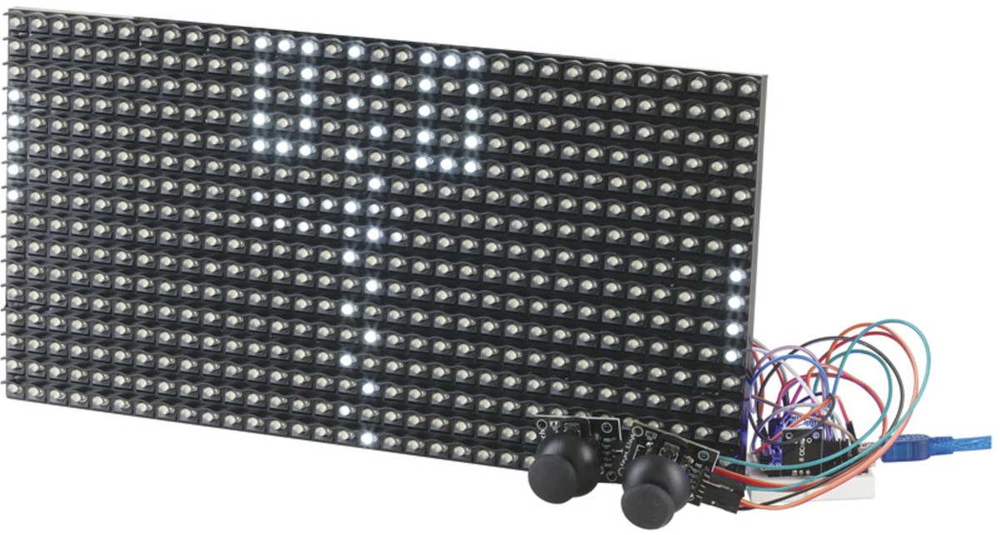
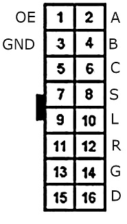
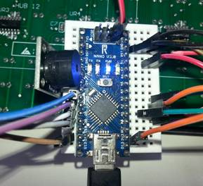
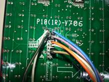
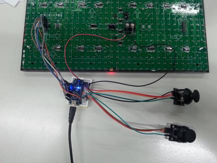
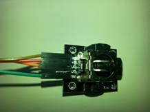

# Two Player Pong Game

Create your own version of the classic Pong game with one of our super bright LED matrix boards and an Arduino Nano. Make a stylish talking point for your wall or coffee table, or just a fun game to play. Easy to assemble with Duinotech parts and no soldering, this retro project is something all ages can enjoy.

## Bill of Materials

| Qty | Code                                     | Description                  |
| --- | ---------------------------------------- | ---------------------------- |
| 1   | [XC4414](https://jaycar.com.au/p/XC4414) | Nano                         |
| 1   | [XC4622](https://jaycar.com.au/p/XC4622) | White LED Dot Matrix Display |
| 2   | [XC4422](https://jaycar.com.au/p/XC4422) | Joystick Modules             |
| 1   | [XC4424](https://jaycar.com.au/p/XC4424) | Buzzer module                |
| 1   | [PB8817](https://jaycar.com.au/p/PB8817) | Mini Breadboard              |
| 1   | [WC6028](https://jaycar.com.au/p/WC6028) | Plug socket leads            |

## Software Libraries

| Library  | Author             | Version |
| -------- | ------------------ | ------- |
| TimerOne | Jesse Tane, et al. | 1.1.0   |

You will also need the DMD library which has been included in this project.

## System Connections

| Nano | DMD      | Buzzer | Joystick 1 | Joystick 2 | Function          |
| ---- | -------- | ------ | ---------- | ---------- | ----------------- |
| 5V   | 5V       |        | +5V        | +5V        | Power             |
| GND  | GND (x2) |        | GND        | GND        | Ground            |
| 2    |          | -      |            |            | Ground for Buzzer |
| 4    |          | S      |            |            | Output for buzzer |
| 6    | 2        |        |            |            | Row selector A    |
| 7    | 4        |        |            |            | Row selector B    |
| 8    | 10       |        |            |            | Latch             |
| 9    | 1        |        |            |            | Output Enable     |
| 11   | 12       |        |            |            | Serial Data       |
| 13   | 8        |        |            |            | Serial Clock      |
| A0   |          |        | VRx        |            | Player 1 position |
| A1   |          |        | SW         |            | Player 1 button   |
| A2   |          |        |            | VRx        | Player 2 position |
| A3   |          |        |            | SW         | Player 2 button   |

The 5V connection to the DMD panel can go the pin 2 of the ICSP header, which will let you use plug-socket jumpers for all the connectors.

This is the pinout of the connector on the panel – the panel should be facing up (the arrows on the back of the panel will face up and right), and the connections are made to the left hand connector.

## Assembly

The first step will be to plug the Nano into the breadboard - note the picture below where the Nano is offset to allow extra connections on one side.

The most difficult part of the assembly is the connections between the breadboard and the dot matrix panel. Ensure that you connect to the left hand connector (closest to VCC) looking at the back of the display.

Double check the connections, and make sure that no wires are in the wrong place. Note also the two wires running to the power screw terminals towards the middle of the display panel.

The buzzer module is straightforward- it just connects to pins 2, 3 and 4. The joystick modules each have four wires, below is an image with the handle removed.

Power can be supplied through the USB port- even though it is recommended to run the display from a 3A supply, the panel should not have more than 50 LED’s on at a time (out of 512), shouldn’t need more than 300mA under normal use. You could use a 6xAA battery holder and feed power into the VIN and GND pins if you don’t want to be tethered to a USB cable. The joystick wires could be extended by plugging multiples plug-socket cables end to end.

## Programming source code

The sketch for this project relies on a library called DMD to drive the panel, which in turn requires another library called TimerOne to automate the scanning of the display. These can be downloaded from [https://github.com/freetronics/DMD/archive/master.zip](https://github.com/freetronics/DMD/archive/master.zip) and [https://storage.googleapis.com/google-code-archive-downloads/v2/code.google.com/arduino-timerone/TimerOne-r11.zip](https://storage.googleapis.com/google-code-archive-downloads/v2/code.google.com/arduino-timerone/TimerOne-r11.zip) respectively. Make sure the libraries are installed, and then compile the code, making sure the Nano board is selected. If Pong does not come to life, there is probably a wiring error with the display. Try pressing down the joysticks- you should get sounds from the buzzer as the ball moves around.

## Gameplay

The ball starts with Player 1 on the left, and is served by clicking down on the joystick. The bats can be moved up and down with the joysticks, and when a player misses, the other player scores a point and gets to serve. After one player gets to seven points, the game ends and a short tune plays, after which, the game returns to its starting state. The angle that the ball bounces off the bats depends on where it hits the bats, and also a little bit of randomness, just to stop the game from getting predictable.

## Improvements

You’ll probably find it gets a bit awkward trying to play with the display panel floating around and the joysticks having such short leads, so the first step would be to mount the panel and install longer leads for the joysticks- you could even design a little 3d-printed box for the joysticks to make them easier to hold. If you don’t like the joysticks, an old-school paddle controller could be made from a small enclosure, a potentiometer and a pushbutton. Or make things really tricky and use an analog distance sensor like XC4585.

To tweak the skill levels, the delay between screen updates (currently 30ms) can be increased to make the ball move slower or decreased to make it faster. The bat size is also a variable that can be changed.

The DMD library can support multiple panels, so there’s no reason that you can’t make a bigger display- you might just need to change the sketch to suit.

## 3D Printable Bracket:

We've included a 3D printable bracket in this repo!
