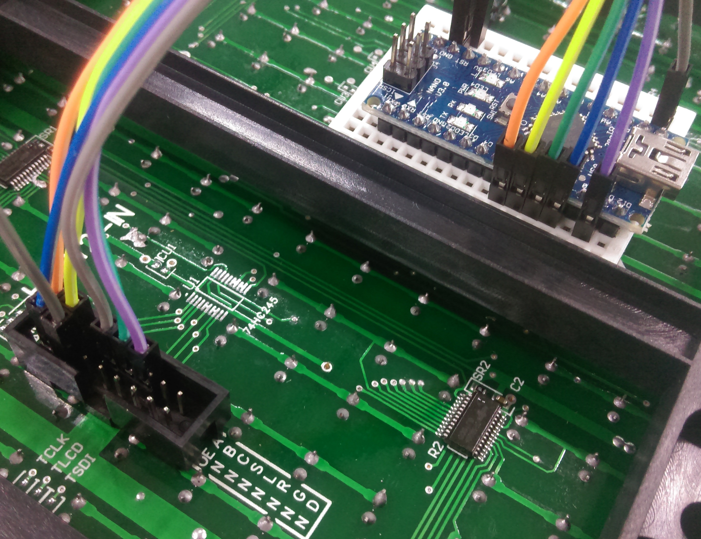
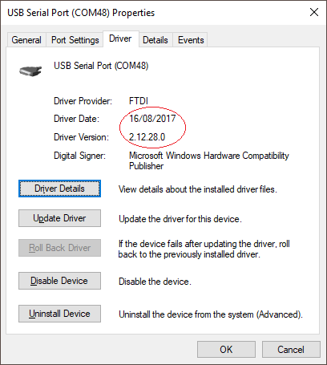

# Two Player Pong Game


Create your own version of the classic Pong game with one of our super bright LED matrix boards and an Arduino Nano. Make a stylish talking point for your wall or coffee table, or just a fun game to play. Easy to assemble with Duinotech parts and no soldering, this retro project is something all ages can enjoy.

## Bill of Materials

| Qty | Code                                     | Description                  |
| --- | ---------------------------------------- | ---------------------------- |
| 1   | [XC4414](https://jaycar.com.au/p/XC4414) | Nano                         |
| 1   | [XC4622](https://jaycar.com.au/p/XC4622) | White LED Dot Matrix Display |
| 2   | [XC4422](https://jaycar.com.au/p/XC4422) | Joystick Modules             |
| 1   | [XC4424](https://jaycar.com.au/p/XC4424) | Buzzer module                |
| 1   | [PB8817](https://jaycar.com.au/p/PB8817) | Mini Breadboard              |
| 1   | [WC6028](https://jaycar.com.au/p/WC6028) | Plug socket leads            |

## Software Libraries

| Library  | Author             | Version |
| -------- | ------------------ | ------- |
| TimerOne | Jesse Tane, et al. | 1.1.0   |

You will also need the DMD library which has been included in this project.

## System Connections

| Nano | DMD      | Joysticks | Description       |
| ---- | -------- | --------- | ----------------- |
| 5V   | 5V       | +5V (x2)  | Power             |
| GND  | GND (x2) | GND (x2)  | Ground            |
| 6    | 2 (A)    |           | Row selector A    |
| 7    | 4 (B)    |           | Row selector B    |
| 8    | 10 (L)   |           | Latch             |
| 9    | 1 (OE)   |           | Output Enable     |
| 11   | 12 (R)   |           | Serial Data       |
| 13   | 8 (S)    |           | Serial Clock      |
| A0   |          | VRx (1)   | Player 1 position |
| A1   |          | SW (1)    | Player 1 button   |
| A2   |          | VRx (2)   | Player 2 position |
| A3   |          | SW (2)    | Player 2 button   |

- Note that both of the joysticks are connect to 5V and GND, Then each of the `VRx` and `SW` pins from each controller is connected to `A0` to `A3`
- The DMD power NEEDS 5V power connected to the screw terminals, on both the `5V` and the `GND` pins, you can use either the `ISCP` pins for the nano, or you could use the nano's `VIN` pin to provide power, as long as you are running the nano off USB.

| Nano | Buzzer | Description        |
| ---- | ------ | ------------------ |
| 2    | -      | Buzzer ground      |
| 4    | S      | Buzzer tone signal |


This is the pinout of the connector on the panel – the panel should be facing up (the arrows on the back of the panel will face up and right), and the connections are made to the left hand connector.

You should find it is labelled `HUB12-IN`

## Assembly

The first step will be to plug the Nano into the breadboard - note the picture below where the Nano is offset to allow extra connections on one side.




The most difficult part of the assembly is the connections between the breadboard and the dot matrix panel. Ensure that you connect to the left hand connector (closest to VCC) looking at the back of the display.


Double check the connections, and make sure that no wires are in the wrong place. Note also the two wires running to the power screw terminals towards the middle of the display panel.

The buzzer module is straightforward- it just connects to pins 2, 3 and 4. The joystick modules each have four wires, below is an image with the handle removed.


Power can be supplied through the USB port- even though it is recommended to run the display from a 3A supply, the panel should not have more than 50 LED’s on at a time (out of 512), shouldn’t need more than 300mA under normal use. You could use a 6xAA battery holder and feed power into the VIN and GND pins if you don’t want to be tethered to a USB cable. The joystick wires could be extended by plugging multiples plug-socket cables end to end.

## Programming source code

The sketch for this project relies on a library called DMD to drive the panel, which has been included in the main sketch folder.

You will also need to make sure that the `TimerOne` library is installed, through the Arduino Library manager.

Select the NANO in the `Tools > Boards` menu and upload. If you find that it is not working, change `Tools > Processor` to `ATmega328P (Old Bootloader)`

If you find that there is no port on the arduino IDE, so you can not change what `PORT` the arduino is programming, make sure you have the `FTDI` drivers installed; you can do this by going to your device manager and making sure that you can see a `COM##` number there under "Ports" (where `##` could be any number other than `3` which is the windows default port).

If you cannot find a port; you can download drivers from here: <https://www.ftdichip.com/Drivers/VCP.htm> - try to get an earlier version of the drivers to avoid any issues, as FTDI have been in the news about not working with chips that they determine to be non-genuine. Below is a screenshot of our drivers.



If Pong does not come to life, there is probably a wiring error with the display. Try pressing down the joysticks- you should get sounds from the buzzer as the ball moves around.

## Game play

The ball starts with Player 1 on the left, and is served by clicking down on the joystick. The bats can be moved up and down with the joysticks, and when a player misses, the other player scores a point and gets to serve. After one player gets to seven points, the game ends and a short tune plays, after which, the game returns to its starting state. The angle that the ball bounces off the bats depends on where it hits the bats, and also a little bit of randomness, just to stop the game from getting predictable.

## Future Improvements

If you don't like the joysticks, an old-school paddle controller could be made from a small enclosure, a potentiometer and a push button. Or make things really tricky and use a distance sensor like [XC4442](https://jaycar.com.au/p/XC4442).

The code also needs a bit of work to make it tidier and more readable, so feel free to fix up the code in a way that makes sense to you and help us out!

To tweak the skill levels, the delay between screen updates (currently 30ms) can be increased to make the ball move slower or decreased to make it faster. The bat size is also a variable that can be changed.

```cpp

// gameplay definitions
const int batsize = 4;
const long update_rate = 30;

//tones and sounds while playing
const int ball_paddle_tone = 512;
const int ball_wall_tone = 128;
const int serve_tone = 256;

```

The DMD library can support multiple panels, so there's no reason that you can't make a bigger display- you might just need to change the sketch to suit.

## 3D Printable Files

We have included two STL files in this project for you to add to your project.

- `joystick-case.stl` to enclose the joystick into an easy to hold case.
- `panel-bracket.stl` to hold up the [XC4622](https://jaycar.com.au/p/XC4622) panel.

Have a go of printing these on our [TL4210](https://jaycar.com.au/p/TL4210) printers.
